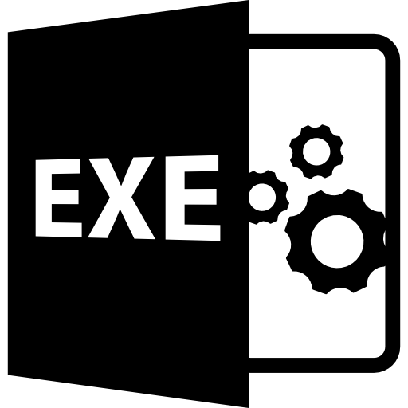

# CURSO DE EXE
👨‍⚖️UM ARQUIVO EXECUTÁVEL (.EXE) É UM ARQUIVO QUE CONTÉM INSTRUÇÕES EM LINGUAGEM DE MÁQUINA (CÓDIGO BINÁRIO) QUE PODEM SER EXECUTADAS DIRETAMENTE POR UM COMPUTADOR. É COMUMENTE USADO PARA INICIAR UM PROGRAMA OU APLICATIVO PARA DESKTOP.

  

## CONCEITO:
Um executável, muitas vezes referido como um "arquivo executável" ou "binário executável", é um arquivo que contém um programa pronto para ser executado ou "executado" em um computador. Este arquivo é geralmente formado por instruções de código de máquina específicas para a arquitetura do processador alvo.

Vamos desdobrar o conceito:

1. **Código Fonte:**
   - O código fonte é o programa escrito em uma linguagem de programação específica, compreensível para os programadores. Este código precisa ser traduzido para um formato executável antes de poder ser executado.

2. **Compilação/Interpretação:**
   - Dependendo da linguagem de programação, o código fonte é traduzido para código de máquina de uma das duas maneiras:
     - **Compilação:** O código fonte é transformado em código de máquina (ou um código intermediário) por um compilador antes da execução.
     - **Interpretação:** O código fonte é lido e executado linha por linha por um interpretador durante o tempo de execução.

3. **Arquivo Executável:**
   - Se o código foi compilado, o arquivo executável resultante contém as instruções de código de máquina diretamente. Se foi interpretado, o arquivo executável pode conter o código fonte ou um bytecode interpretado.

4. **Execução:**
   - O sistema operacional ou a máquina virtual lê e executa as instruções contidas no arquivo executável.

5. **Resultados:**
   - O programa realiza suas tarefas conforme definido no código fonte, interagindo com o sistema operacional, hardware e outros recursos conforme necessário.

Exemplos de arquivos executáveis incluem:
- **Windows:** `.exe`
- **Linux/Unix:** Sem extensão específica, mas muitas vezes não tem extensão.
- **Java:** `.jar` (contendo bytecode executável para a Máquina Virtual Java).

Ter um executável facilita a distribuição de software, pois os usuários finais podem executar o programa sem precisar do código fonte ou do ambiente de desenvolvimento instalado. 

## SUBSIDIOS:
- [CURSO CRIADO PELO VILHALVA](https://github.com/VILHALVA)
- [VEJA A DOCUMENTAÇÃO DO PYINSTALLER](https://pyinstaller.readthedocs.io/en/stable/index.html)
- [VEJA A DOCUMENTAÇÃO DO GCC](https://gcc.gnu.org/onlinedocs/)
- [VEJA O PROCESSO](./PROCESSO.md)
- [VEJA OS PROJETOS](https://github.com/VILHALVA?tab=repositories&q=topic:EXE)
